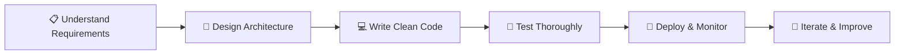

<div align="center">

# Hi there, I'm Muhammad Anas 👋

### Full-Stack Web Developer | Building Scalable & Modern Web Apps

[](https://git.io/typing-svg)

<br/>

[](https://www.linkedin.com/in/muhammad-anas-3632ba417/)
[](https://loquacious-choux-cf9bfd.netlify.app/#)
[](mailto:codewithmanas47@gmail.com)
[](https://github.com/muhammadanas)


</div>

---

## 🧑‍💻 About Me

```typescript
const muhammadAnas = {
  role        : "Full-Stack Web Developer",
  location    : "Pakistan 🇵🇰",
  experience  : "Building production-ready web apps end-to-end",
  focus       : ["Clean Architecture", "Performance", "Great UX"],
  available   : "Remote Freelance & Full-time Opportunities",
  exploring   : ["AI/LLM Integrations", "Edge Functions", "Web3"],
  funFact     : "I debug at 2am and still enjoy it 😄",
};
```

> 💡 *I don't just write code — I build digital products that solve real problems, scale gracefully, and feel great to use.*

---

## 🚀 What I Bring to the Table

| 💼 Area | ✅ What I Deliver |
|---|---|
| **Frontend** | Pixel-perfect, responsive UIs with smooth animations |
| **Backend** | RESTful & GraphQL APIs built for scale and security |
| **Database** | Optimized schemas, queries, and caching strategies |
| **DevOps** | CI/CD pipelines, Docker containers, cloud deployments |
| **Code Quality** | Clean, maintainable, well-documented code always |
| **Delivery** | On time, with clear communication throughout |

---

## 🛠️ Tech Stack

### 🎨 Frontend


### ⚙️ Backend


### 🗄️ Database & Caching


### ☁️ DevOps & Cloud


### 🧰 Tools & Workflow


---

## 📊 GitHub Stats

<div align="center">


<br/>


</div>

---

## 🏆 GitHub Trophies

<div align="center">


</div>

---

## 💼 Services I Offer

```
✅  Custom Web Application Development  (React / Next.js / Node.js)
✅  REST API & GraphQL Backend Development
✅  Database Design & Optimization       (PostgreSQL / MongoDB / Redis)
✅  Frontend UI/UX Implementation        (Tailwind CSS / Shadcn / Framer Motion)
✅  Docker Setup & Cloud Deployment      (AWS / Vercel / GitHub Actions)
✅  Code Review & Performance Auditing
✅  Long-term Maintenance & Support
```

---

## 📈 My Development Approach



---

## 🌟 Why Work With Me?

- 🎯 **Results-oriented** — I focus on shipping products that actually work in production
- 🔍 **Detail-obsessed** — From pixel alignment to query optimization, nothing is too small
- 💬 **Clear communicator** — Regular updates, no surprises, always reachable
- 📚 **Always learning** — Keeping up with the latest tools and best practices
- 🤝 **Team player** — Can work solo or integrate smoothly into existing teams
- ⏰ **Deadline-driven** — Respect for your time is non-negotiable

---

## 📫 Let's Build Something Great Together!

<div align="center">

> *Have a project in mind? Let's talk!*

[](https://www.linkedin.com/in/muhammad-anas-3632ba417/)
[](mailto:codewithmanas47@gmail.com)
[](https://loquacious-choux-cf9bfd.netlify.app/#)

<br/>

### 💬 *"Clean code. Real products. Continuous growth."* 🚀

---

⭐ *If you find my work helpful, consider giving a star to my repos!*

</div>
